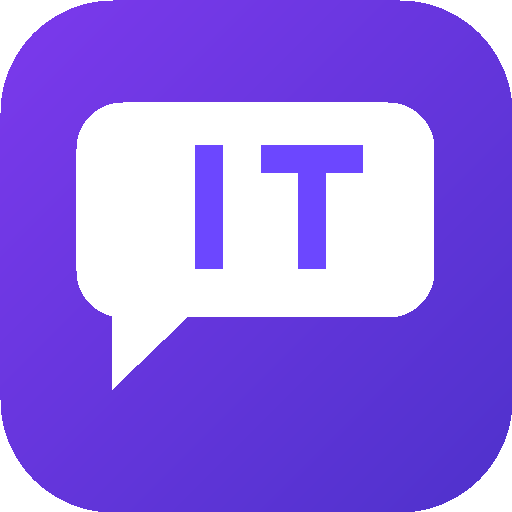
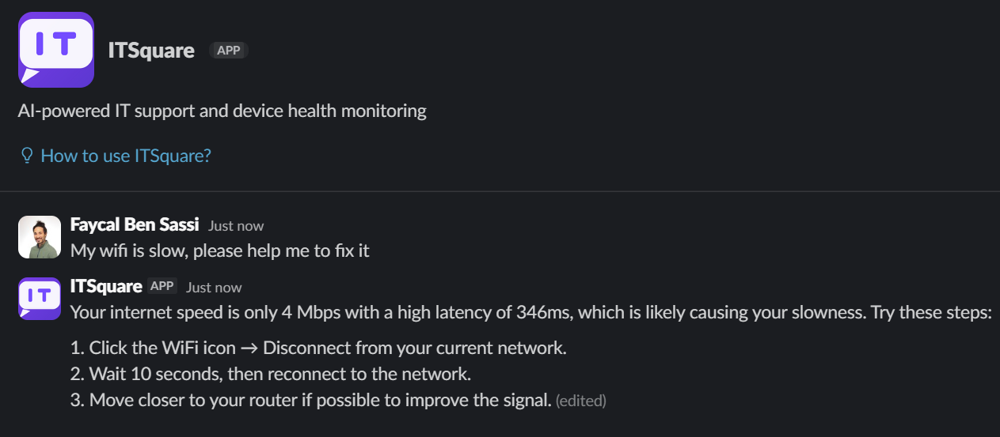
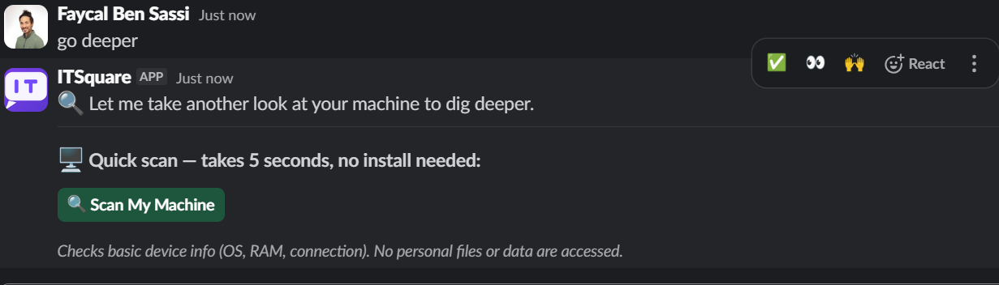
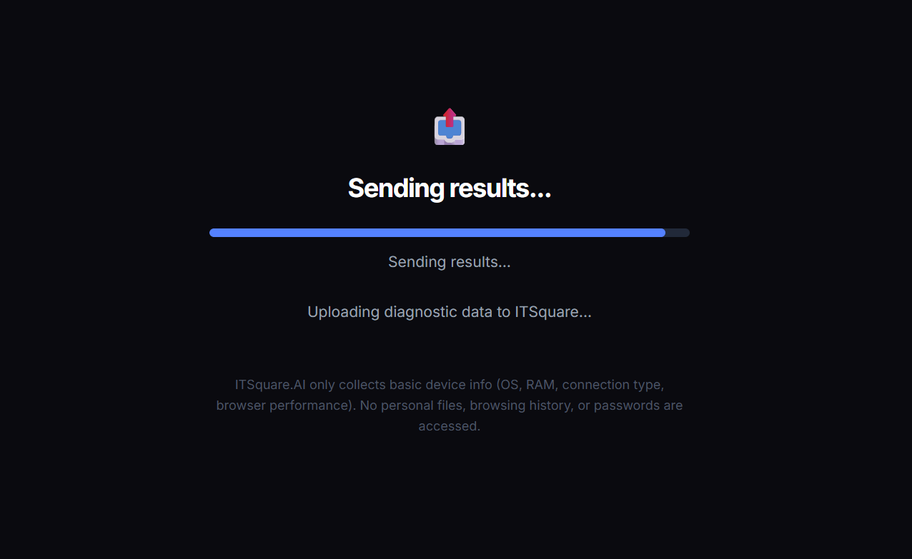
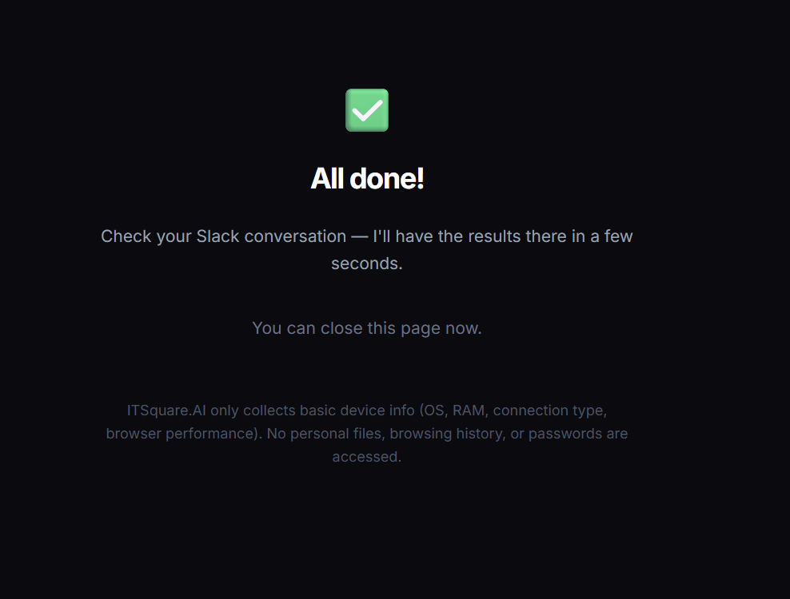
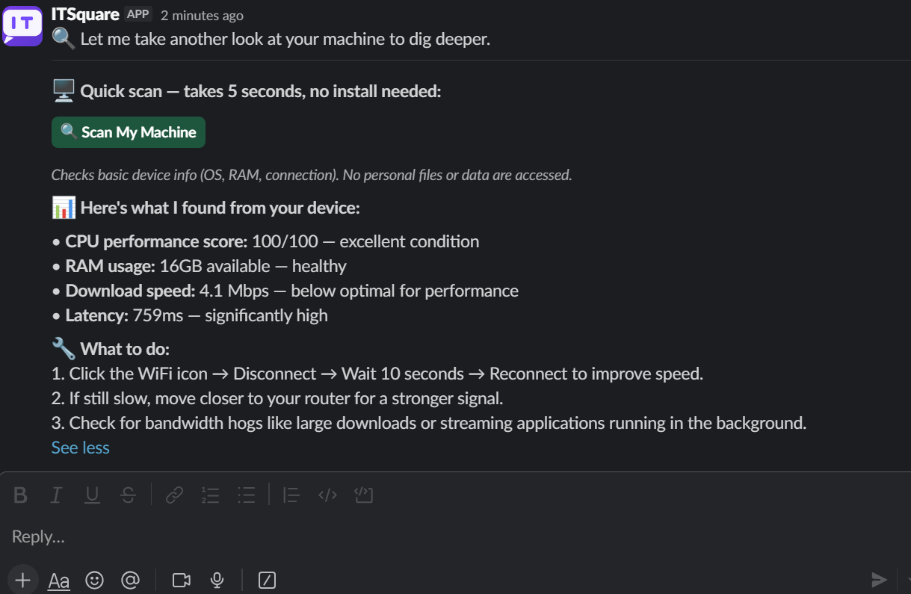
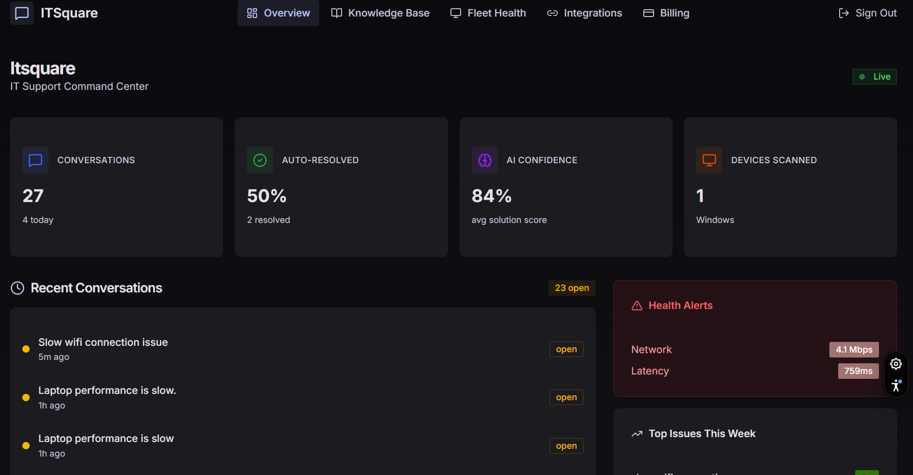

<p align="center">
  
</p>

<h1 align="center">ITSquare.AI</h1>

<p align="center">
  <strong>Your AI IT Support Team — Lives in Slack</strong>
</p>

<p align="center">
  Employees describe their tech problems in plain English. ITSquare diagnoses, troubleshoots, and resolves them — instantly, inside Slack. No tickets. No waiting. No frustration.
</p>

<p align="center">
  <a href="https://itsquare.ai">Website</a> · <a href="https://www.loom.com/share/47038749f573472884d8076a7e4607ab">Watch Demo</a> · <a href="https://itsquare.ai/auth/sign-up">Start Free</a> · <a href="https://itsquare.ai/docs">Docs</a>
</p>

<p align="center">
  
  
  
  
  
  
</p>

---

## 🎬 Demo

> **[▶️ Watch the full demo on Loom](https://www.loom.com/share/47038749f573472884d8076a7e4607ab)** — See ITSquare.AI diagnose and resolve a slow WiFi issue in real-time, entirely inside Slack.

---

## The Problem

| | |
|---|---|
| ⏰ **4.2 hours/week** | Average time employees lose to IT issues |
| 🔄 **67% of tickets** | Are repeat questions with known solutions |
| 💸 **$127 per ticket** | Average cost of IT support (Gartner) |

Traditional IT support is broken: employees submit tickets, wait hours (or days), and IT teams drown in repetitive questions they've already answered. The knowledge exists — it's just locked in someone's head or buried in a doc no one can find.

## The Solution

ITSquare.AI is an AI-powered IT support agent that lives natively in Slack. Employees just describe their problem in natural language — and get an instant, actionable resolution.

No new tools. No context switching. No ticket queues. Just type and get help.

---

## ✨ Features

### 🤖 AI Conversations with Real Diagnostics
Employees describe problems in plain English. ITSquare doesn't just guess — it investigates. The AI pulls from conversation history, colleague resolutions, knowledge base articles, and live device diagnostics to build a complete picture before responding.

<p align="center">
  
</p>

### 🔍 Zero-Install Device Scanning
When the AI needs deeper insight, it offers a **browser-based diagnostic scan** — no software to install, no admin permissions needed. One click, 5 seconds, done. Results flow directly back into the Slack conversation.

<p align="center">
  
</p>

<p align="center">
  
  &nbsp;&nbsp;
  
</p>

The scan collects: CPU performance score, RAM availability, download speed, latency, OS, browser, and connection type. **No personal files, browsing history, or passwords are accessed.**

Once the scan completes, results flow directly back into the Slack thread — the AI uses the diagnostics to deliver a **personalized, data-driven resolution** right where the conversation started:

<p align="center">
  
</p>

### 📊 IT Command Center Dashboard
A real-time admin dashboard gives IT teams full visibility: conversation volume, auto-resolution rates, AI confidence scores, device fleet health, and trending issues — all in one place.

<p align="center">
  
</p>

### 🧠 Multi-Source Investigation Engine
Every conversation triggers a 4-source investigation:
1. **User history** — Has this person had this issue before?
2. **Colleague resolutions** — Has someone else solved this exact problem?
3. **Knowledge base** — Do company docs/runbooks cover this?
4. **Device diagnostics** — What does the machine actually report?

### 📚 RAG Knowledge Base
Connect your company's internal docs. ITSquare uses pgvector embeddings to search your knowledge base and deliver company-specific answers — not generic advice from the internet.

### 🛡️ Command Execution Engine
For power users: ITSquare can propose diagnostic and remediation commands with a **4-tier safety model**:
- **Read-only** — Safe to run automatically (system info, network checks)
- **Safe modification** — Low risk, shown for one-click approval
- **Manual** — Requires explicit user confirmation with full command review
- **Blocked** — Dangerous operations are never proposed

Interactive Block Kit buttons let users `[▶ Run All]` `[📋 Review Each]` or `[❌ Skip]`.

### 📈 Solution Effectiveness Tracking
Every resolution gets a confidence score. Solutions that work get reinforced; solutions that fail decay. High-confidence resolutions are automatically extracted into the knowledge base — the system gets smarter with every conversation.

### 🏥 Device Health Monitoring
The `device_health_snapshots` table tracks device metrics over time. Trend detection surfaces degrading hardware before employees even report problems.

---

## 🏗️ Architecture

```
┌──────────────────────────────────────────────────────────┐
│                      Slack Workspace                      │
│                                                           │
│   Employee: "My WiFi is slow"                            │
│        │                                                  │
│        ▼                                                  │
│   ┌──────────┐  Events API / Slash Commands              │
│   │ ITSquare │ ─────────────────────────────────┐        │
│   │   Bot    │                                   │        │
│   └──────────┘                                   │        │
└──────────────────────────────────────────────────│────────┘
                                                   │
                                                   ▼
┌──────────────────────────────────────────────────────────┐
│                    Vercel (Serverless)                     │
│                                                           │
│  ┌─────────────┐  ┌──────────────┐  ┌────────────────┐  │
│  │  Slack API   │  │  AI Engine   │  │  Diagnostic    │  │
│  │  Handlers    │  │  (GPT-4o-m)  │  │  Scanner       │  │
│  └──────┬──────┘  └──────┬───────┘  └───────┬────────┘  │
│         │                │                    │           │
│  ┌──────┴────────────────┴────────────────────┴──────┐   │
│  │              Investigation Engine                  │   │
│  │  User History │ Colleague Fixes │ KB │ Device Scan │   │
│  └───────────────────────┬───────────────────────────┘   │
│                          │                                │
│  ┌───────────────────────┴───────────────────────────┐   │
│  │           Solution Tracker & Confidence            │   │
│  └───────────────────────────────────────────────────┘   │
└──────────────────────────────────────────────────────────┘
                           │
                           ▼
┌──────────────────────────────────────────────────────────┐
│                   Supabase (Postgres)                      │
│                                                           │
│  slack_workspaces  │  conversation_threads  │  solutions  │
│  slack_conversations │  device_health_snapshots           │
│  knowledge_base (pgvector)  │  organizations  │  billing  │
└──────────────────────────────────────────────────────────┘
```

---

## 🛠️ Tech Stack

| Layer | Technology |
|-------|-----------|
| **Framework** | Next.js 16, React 19, TypeScript |
| **UI** | Tailwind CSS, shadcn/ui, Radix UI |
| **AI** | Vercel AI SDK + OpenAI GPT-4o-mini |
| **Embeddings** | OpenAI text-embedding-3-small (pgvector) |
| **Database** | Supabase (Postgres + pgvector + RLS + Auth) |
| **Slack** | Direct Web API + Events API (no SDK wrappers) |
| **Billing** | Stripe Checkout + Webhooks |
| **Hosting** | Vercel (serverless) |
| **Testing** | Vitest (68 tests passing) |
| **CI/CD** | GitHub Actions |
| **Security** | AES-256-GCM token encryption, request signing, rate limiting, CSP headers |

---

## 📁 Project Structure

```
itsquare.ai/
├── app/
│   ├── api/
│   │   ├── slack/          # OAuth, events, commands, interactions
│   │   ├── agent/          # Device scanning, diagnostics, results
│   │   ├── billing/        # Stripe checkout, webhooks, portal
│   │   ├── dashboard/      # Admin stats API
│   │   └── knowledge/      # RAG knowledge base API
│   ├── dashboard/          # IT admin command center
│   │   ├── knowledge/      # Knowledge base management
│   │   ├── fleet/          # Device fleet health
│   │   ├── integrations/   # Connected services
│   │   └── billing/        # Subscription management
│   ├── auth/               # Login, sign-up, password reset
│   ├── check/[token]/      # Browser diagnostic scan page
│   └── (marketing)         # Landing, docs, privacy, terms, security
├── lib/
│   ├── services/           # Core business logic
│   │   ├── ai.ts           # AI conversation engine
│   │   ├── investigation.ts # 4-source investigation engine
│   │   ├── rag.ts          # RAG retrieval
│   │   ├── embeddings.ts   # Vector embeddings
│   │   ├── solution-tracker.ts # Confidence scoring & decay
│   │   ├── health-trends.ts   # Device health trend detection
│   │   ├── diagnostic-flow.ts # Browser scan orchestration
│   │   ├── command-parser.ts  # Command extraction from AI
│   │   ├── command-safety.ts  # 4-tier safety classification
│   │   └── ...
│   ├── slack/              # Encryption, types
│   ├── stripe/             # Billing integration
│   ├── supabase/           # Database clients
│   └── config/             # Constants, system prompts
├── components/             # React UI components (shadcn/ui)
├── packages/cli/           # @itsquare/agent CLI (device agent)
├── supabase/               # Migrations & database schema
├── __tests__/              # 68 test files (Vitest)
└── scripts/                # Utility scripts
```

---

## 🚀 Getting Started

### Prerequisites

- Node.js 20+
- A [Supabase](https://supabase.com) project
- A [Slack App](https://api.slack.com/apps) configured for OAuth + Events
- An [OpenAI](https://platform.openai.com) API key
- A [Stripe](https://stripe.com) account (for billing)

### 1. Clone & Install

```bash
git clone https://github.com/metalfa/itsquare.ai.git
cd itsquare.ai
npm install
```

### 2. Environment Variables

```bash
cp .env.example .env.local
```

Fill in your keys:

```env
# Supabase
NEXT_PUBLIC_SUPABASE_URL=your-project-url
NEXT_PUBLIC_SUPABASE_ANON_KEY=your-anon-key
SUPABASE_SERVICE_ROLE_KEY=your-service-role-key

# Slack
SLACK_CLIENT_ID=your-client-id
SLACK_CLIENT_SECRET=your-client-secret
SLACK_SIGNING_SECRET=your-signing-secret
SLACK_TOKEN_ENCRYPTION_KEY=your-32-byte-hex-key

# OpenAI
OPENAI_API_KEY=your-openai-key

# Stripe
STRIPE_SECRET_KEY=your-stripe-key
STRIPE_WEBHOOK_SECRET=your-webhook-secret
```

### 3. Database Setup

Run the Supabase migrations:

```bash
npx supabase db push
```

### 4. Configure Slack App

| Setting | URL |
|---------|-----|
| **OAuth Redirect** | `https://your-domain.com/api/slack/callback` |
| **Events URL** | `https://your-domain.com/api/slack/events` |
| **Slash Command** | `/itsquare` → `https://your-domain.com/api/slack/command` |
| **Interactivity** | `https://your-domain.com/api/slack/interactions` |

### 5. Run

```bash
npm run dev
```

---

## 🧪 Testing

```bash
# Run all tests
npm test

# Watch mode
npm run test:watch

# Lint
npm run lint
```

**68 tests** covering: Slack signature verification, token encryption, AI response generation, command safety classification, investigation engine, RAG retrieval, billing webhooks, and rate limiting.

---

## 💰 Pricing

| Plan | Price | Includes |
|------|-------|----------|
| **Free** | $0/forever | 50 AI conversations/month, basic troubleshooting |
| **Pro** | $8/user/month | Unlimited conversations, knowledge base, smart escalation, analytics |
| **Enterprise** | Custom | SSO/SAML, dedicated support, custom AI training, SLA |

All plans include a 14-day free trial. No credit card required.

---

## 🔒 Security

- **AES-256-GCM** encryption for all stored Slack tokens
- **HMAC signature verification** on every Slack request
- **Rate limiting** on all API endpoints
- **Content Security Policy** headers
- **Row-Level Security** on all Supabase tables
- **No personal data collection** — device scans only collect OS, RAM, connection type, and browser performance metrics
- Full [Privacy Policy](https://itsquare.ai/privacy) and [Security](https://itsquare.ai/security) documentation

---

## 🗺️ Roadmap

- [x] Core AI conversations in Slack (DMs + @mentions + /itsquare)
- [x] Multi-turn conversation threading
- [x] RAG knowledge base with pgvector
- [x] 4-source investigation engine
- [x] Browser-based device diagnostics (zero-install)
- [x] Command execution with 4-tier safety model
- [x] Solution effectiveness tracking with confidence decay
- [x] Device health history & trend detection
- [x] IT admin command center dashboard
- [x] Stripe billing integration
- [ ] Smart escalation (expertise profiles, calendar integration)
- [ ] Pattern detection (proactive issue alerting)
- [ ] App Home with fleet dashboard
- [ ] Runbooks & automated remediation workflows
- [ ] Slack App Marketplace listing

---

## 🤝 Contributing

This is currently a private product. If you're interested in contributing or partnering, reach out at [brucelee@itsquare.ai](mailto:brucelee@itsquare.ai).

---

## 📄 License

Proprietary. © 2026 IT Square. All rights reserved.

---

<p align="center">
  <strong>Built by <a href="https://itsquare.ai">IT Square</a> in Chicago 🏙️</strong>
  <br />
  <a href="https://itsquare.ai">itsquare.ai</a> · <a href="mailto:brucelee@itsquare.ai">brucelee@itsquare.ai</a> · <a href="https://calendly.com/bensassi-faysel/discovery-call">Book a Demo</a>
</p>
